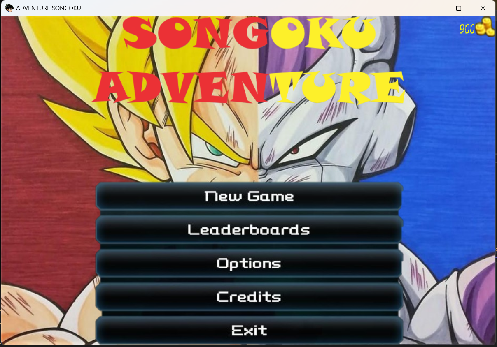
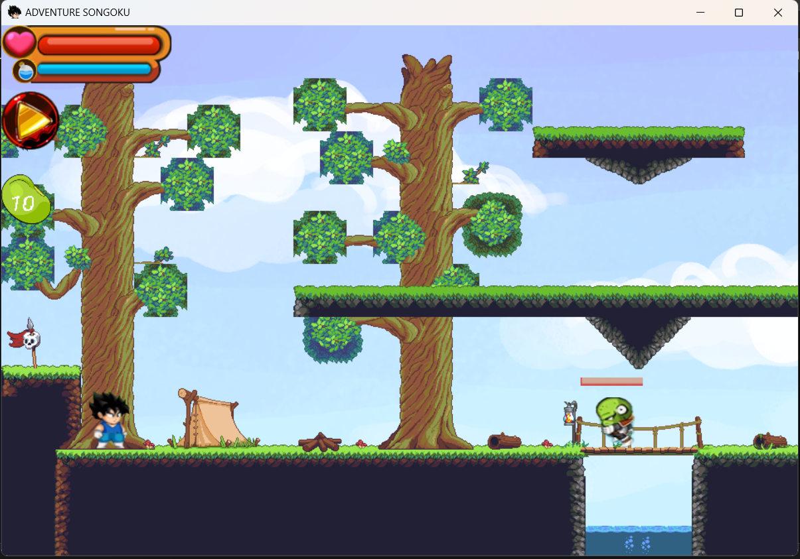
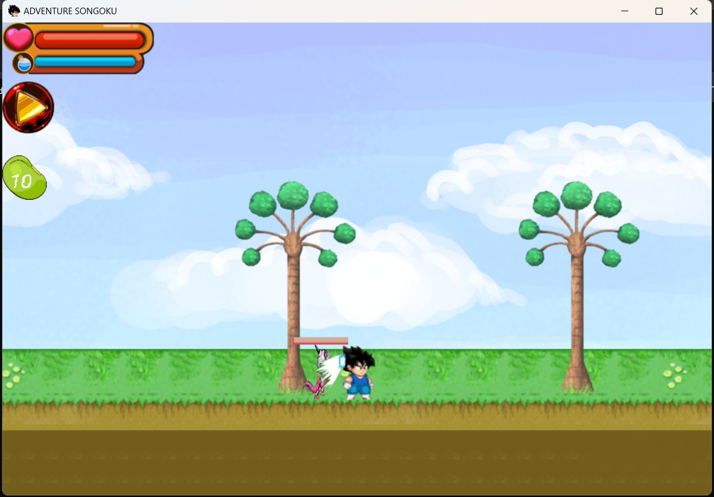
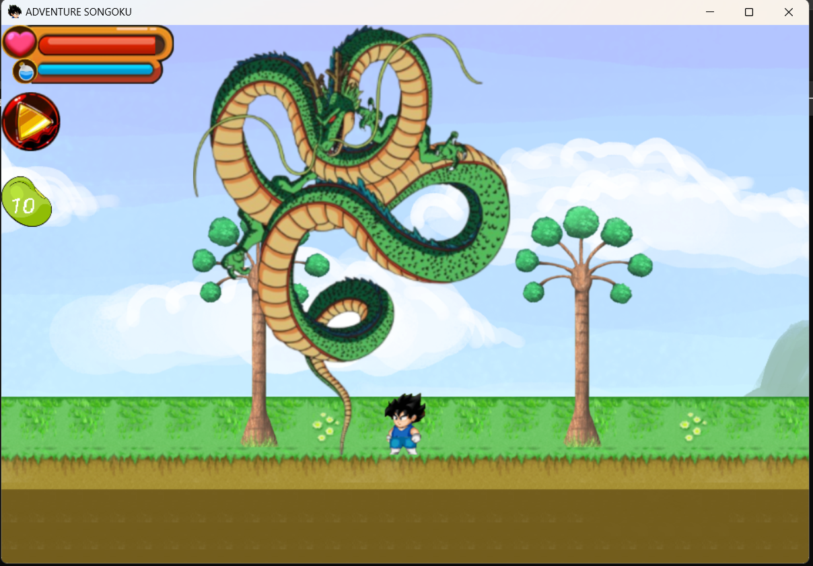
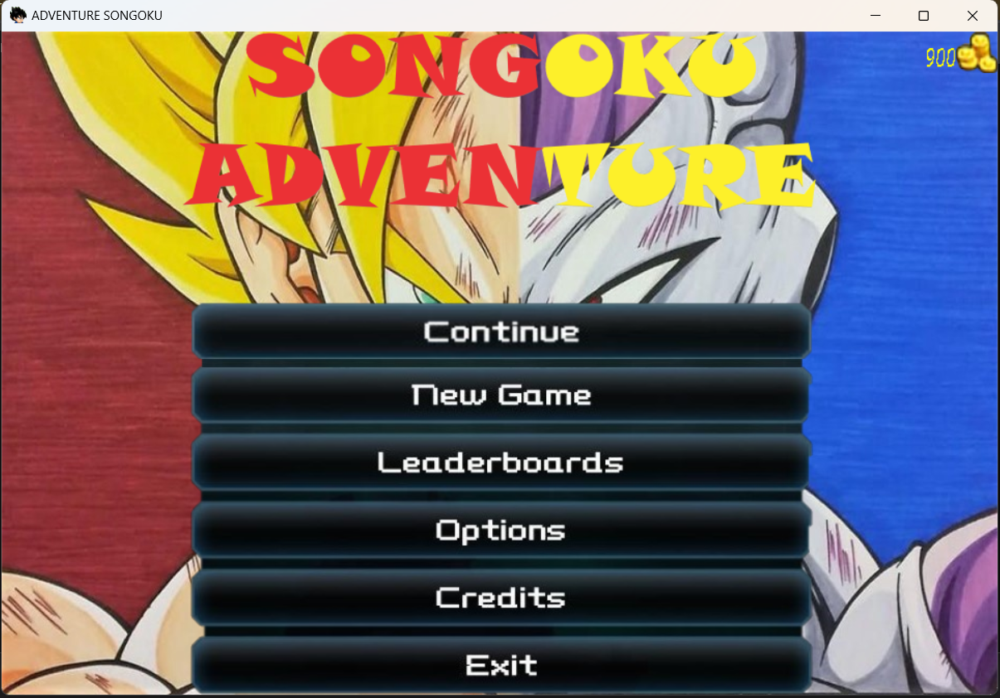
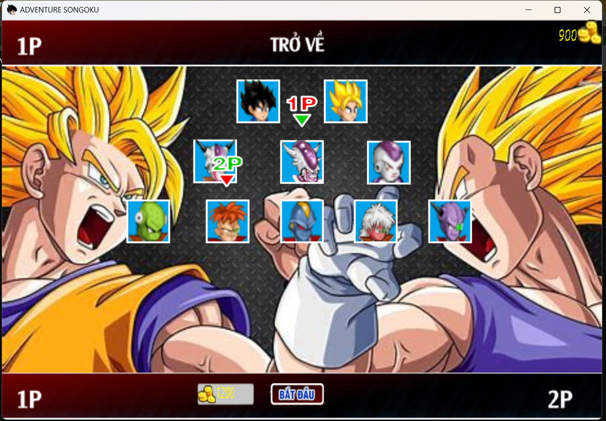
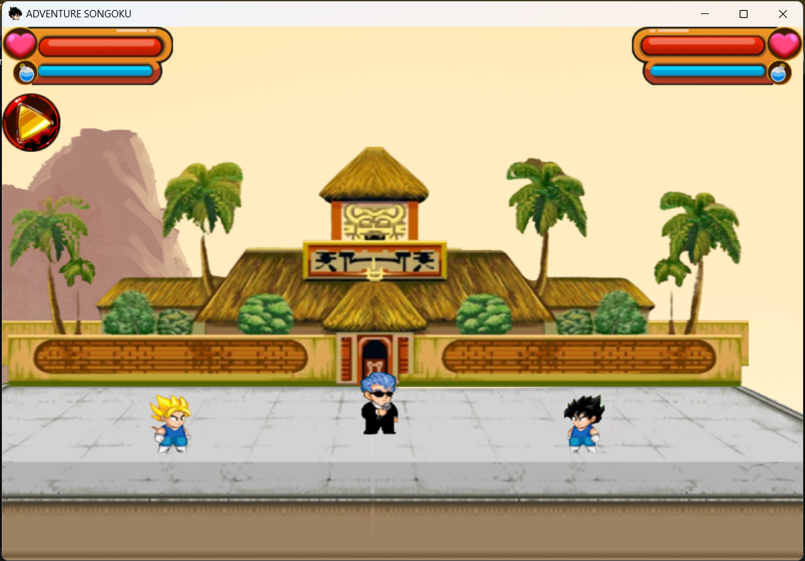
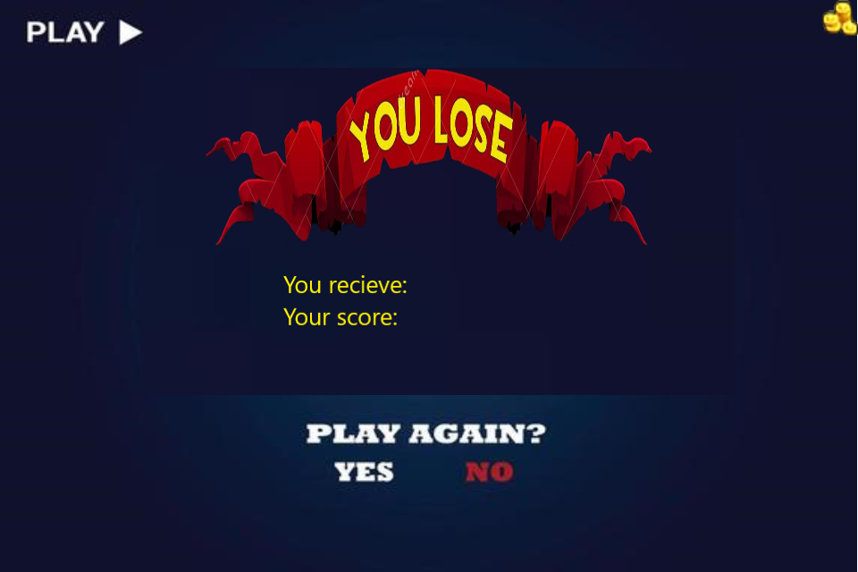

# ADVENTURE SONGOKU
# Giới thiệu
●  Họ và tên: Đoàn Long Nhật

●  Mã số sinh viên: 23020129

●  Lớp: K68 CD, Trường Đại học Công Nghệ, Đại học Quốc Gia Hà Nội.

ADVENTURE SONGOKU là một câu chuyện lấy cảm hứng từ bộ truyện nổi tiếng Dragon Ball trong hành trình Songoku đi đến hành tinh Namek để tìm ngọc rồng hồi sinh cho những người bạn của mình. Ở Namek, Songoku phải đối mặt với đội quân Frieza hùng mạnh và phải trải qua nhiều khó khăn. Hãy hóa thân vào Songoku để đánh bại kẻ thù giành lại ngọc rồng.

# Chi tiết
## Gameplay 
Xem video [tại đây]([https://www.google.com](https://www.youtube.com/watch?v=sNHdWoWrmbs))
## Tutorial 
Game được thao tác bằng chuột và bàn phím
### Mode Story
●  Ấn nút mũi tên phải(trái, lên) hoặc nút D(A, W) để di chuyển

●  Ấn J để tấn công

●  Ấn K, L để dùng skill
### Mode PK
#### Player 1
●  Ấn nút D, A, W để di chuyển

●  Ấn J để tấn công

●  Ấn K để dùng skill
#### Player 2
●  Ấn nút mũi tên phải, trái, lên để di chuyển

●  Ấn 1 để tấn công

●  Ấn 2 để dùng skill
## Nội dung
Game có hai chế độ là chế độ cốt truyệt và chế độ đối kháng:
●  Ở chế độ cốt truyện: Bạn sẽ hóa thân vào Songoku để đánh bại quân đội Frieza dành lại ngọc rồng

●  Ở chế độ đối kháng: Đây là chế độ 2 người chơi, 2 người chơi sẽ chọn nhân vật của mình và đối đầu nhau
## Một số hình ảnh trong game

